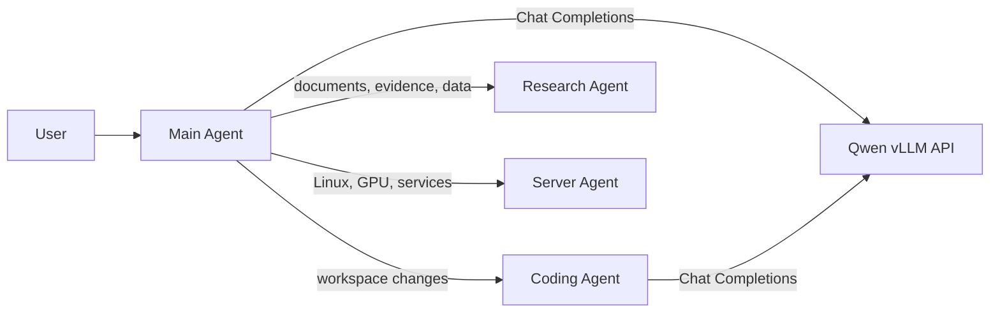

# Agent Architecture

## Overview

The user normally talks to one Main Agent. The Main Agent performs general
conversation and secretary-style coordination, then delegates specialist work
only when appropriate. Qwen remains a separate local OpenAI-compatible model
backend; agent roles are client-side instruction and workflow bundles.

Main, Coding, Research, and Server are active roles. They are instruction and
workflow bundles, not background processes. No additional role is created until
a distinct responsibility requires one.

## Role Boundaries

- Main Agent owns the user relationship, active-session context, memory
  operations, delegation decisions, and unified reporting.
- Coding Agent owns repository investigation, minimal edits, executable
  validation, failure repair, and diff evidence for assigned workspace work.
- Research Agent owns PDF/document review, web evidence, Python/data analysis,
  source tracking, and the separation of source material from interpretation.
- Server Agent owns read-only Linux, GPU, Docker, systemd, and approved SSH
  diagnostics. State changes and all `sudo` commands require human approval and
  post-change health validation.
- All roles inherit the common constitution. Role-specific instructions add
  workflow but cannot relax common safety or secret-handling rules.

## Memory Architecture

Short-term context is an ephemeral active-session input to the model. It is not
saved automatically. Long-term memory is explicit, user-approved structured
data represented by `MemoryRecord` and managed by `InMemoryMemoryStore` for the
initial phase. The initial store is deliberately non-persistent.

Future persistence must be a small adapter writing outside Git to an ignored
local state path. It must preserve the memory policy's explicit-save,
search-by-query, delete-by-ID, multi-delete confirmation, and secret exclusion
rules.

## Delegation Lifecycle

1. Main confirms the user's goal and decides whether Coding specialization is needed.
2. Main sends the Coding Agent a complete typed handoff: goal, constraints,
   acceptance checks, and commit intent.
3. Coding Agent follows its inspect-edit-test-diff workflow and returns
   validation evidence plus a change summary.
4. Main gives the user one consolidated result, including remaining risk.