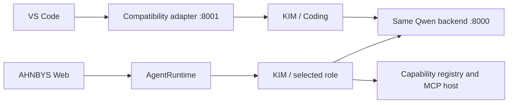

# KIM Coding Role Integration

## Identity And Registry

KIM/Qwen remains the single central LLM. Secretary, Researcher, Coding, Image
Director, Server, Analyst, and Critic are instruction and capability profiles,
not model identities or dedicated inference servers. The central registry is
`runtime/role_registry.py`; existing runtime IDs remain aliases so API and
session compatibility is preserved.

`RoleDefinition` records the canonical ID, display name, description,
instruction file, preferred and default capabilities, permission policy, memory
policy, and output preferences. UI labels use `KIM / Role`.

## Coding Policy

Coding defaults to workspace read, search, edit, and safe execution. These are
provided by the client host, such as VS Code. Optional AHNBYS capabilities are
selected by Qwen from the existing compact catalog only when material:

| Capability | Initial policy |
| --- | --- |
| Context7 documentation | Read, on demand |
| Local Git status/diff/log/show/blame | Read only |
| GitHub repository/code/issues/PRs | Read only; unconfigured without a token |
| Web Research | Read, on demand through SearchRouter and secure fetch |
| Project Knowledge | Read within authenticated request scope |

Workspace edits use `WRITE_WORKSPACE`; safe tests/builds use `EXECUTE_SAFE`.
Commit and push are `WRITE_REPOSITORY` and require an explicit request. Force
push, hard reset, and branch deletion are `DESTRUCTIVE` and require separate
approval; no destructive tool is registered.

## Clients And Cooperation

The adapter preserves the OpenAI request body and compaction repair behavior.
It attaches internal `client=vscode` and `default_role=coder` headers and emits
the same metadata in content-free observability records. Coding is the primary
VS Code role, not a prison: Qwen can select Documentation, GitHub, Web, or
Project expertise when the task needs it. Research and Secretary can likewise
compose coding expertise through the existing central runtime and typed handoff
contract; no agent-to-agent message bus is introduced.

An explicit AHNBYS Project scope enables bounded relevant memory/file retrieval.
The VS Code workspace remains filesystem context and is never treated as the
durable Project object. A future workspace-root to `project_id` mapping must be
an explicit authenticated binding, never path-based inference.

Agent Activity reports the public brain/role identity, capabilities used, tool
name, action class, server, status, execution flag, and duration. It does not
expose private reasoning.

## Regression Benchmark

The initial coding smoke test found that `urlsplit().port` can raise
`ValueError` for malformed ports. The fix expands the existing parse guard over
the complete normalization path. Tests cover malformed ports, unchanged normal
normalization, and merging duplicate malformed URLs. The role suite also covers
on-demand Context7 selection, read-only Git registration, VS Code metadata and
byte-preserving proxy behavior, Web authorization, and KIM/role activity labels.