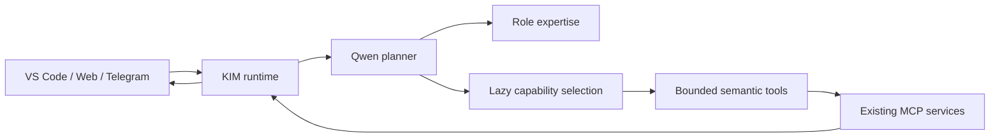

# KIM Capability Architecture

## Production shape

KIM is one Qwen brain with role expertise and lazy capabilities. Roles are not separate models or agent frameworks. The existing planner classifies the request, selects the role and capabilities, and exposes at most ten detailed tool schemas.

Auto-role selection is model-owned. The validated planner field is one of `main`, `coding`, `research`, or `server`. Explicit client role selection remains authoritative. Keyword routing exists only as deterministic compatibility recovery when the planner does not return a valid role.

## Capability inventory

| Capability | Provider | Permission | Production purpose |
|---|---|---|---|
| Web | search/web MCP | `READ` | Current public web and news evidence |
| Browser | Playwright MCP | `READ` | Public rendered-page interaction behind an egress guard |
| Time | developer MCP | `READ` | Exact current time and timezone conversion |
| Documentation | Context7 | `READ` | Current version-specific software documentation |
| GitHub | official GitHub MCP | `READ` | Remote repository evidence; requires a PAT |
| Git | local Git MCP | `READ` | Scoped, read-only repository inspection |
| Academic | academic MCP | `READ` | Multi-provider scholarly identity and publication evidence |
| Project | project MCP | scoped read/write classes | Authorized memories, files, conversations, and artifacts |
| Media | AHN7 media MCP | `READ`, `EXECUTE_MEDIA` | Image planning, generation, edits, pose adjustment, and optional artifact save |

The registry contains 9 capabilities and 40 semantic tools. It does not contain a separate Market capability; current market questions use Web/Research evidence. Adding a tool name that is not in the registry is not a supported fallback.

## Control boundaries

- Role permission policy filters dynamically exposed tools.
- Detailed schemas are capped at 10 per turn.
- Capability selection and execution are both retained in Activity observability.
- Research normalizes planner labels to canonical registry IDs.
- Fetch deduplication is URL based, and Research has a 120-second elapsed guard.
- Browser and Fetch reject private or loopback targets before navigation.
- Project data is scoped to the authorized project and uses opaque file IDs.
- Git and GitHub operations are read-only.
- AHN7 accepts authenticated loopback tunnel traffic and returns opaque media IDs.
- Empty final synthesis receives one bounded direct-synthesis recovery attempt.

## Context contract

The compact capability catalog costs approximately 549 tokens. A typical Web detailed exposure costs 226 tokens. A reasonable four-capability exposure costs 934 tokens. Full schemas are lazy and bounded, so the 32K model context is reserved primarily for the conversation, evidence, and answer.