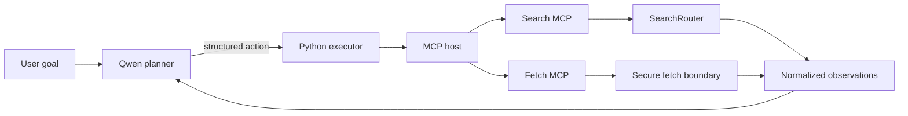

# Model Context Protocol Adoption

## Objective

AHNBYS adopts MCP as a standard tool interface, not as a replacement for its planner, provider policy, or security boundaries.

- Qwen remains the Research planner and chooses the next capability and arguments.
- The MCP host discovers tools, validates calls, applies timeouts, records health, and returns structured outcomes.
- Existing Python services remain the executors and guardrails.
- SearchRouter continues to own provider fallback, quality gates, cache, circuit breakers, and paid-request control.
- `fetch_sources()` continues to own public-address validation, redirect checks, content restrictions, size limits, and extraction.

Phase 1 uses the official Python SDK and in-process transport. The same servers are executable over stdio, but AHNBYS does not expose an MCP network port or create another credential boundary.

## Phase 1 Capabilities

| MCP server | Tool | Existing implementation retained |
| --- | --- | --- |
| `ahnbys-search` | `search_web` | Conditional SearchRouter |
| `ahnbys-search` | `search_news` | Conditional SearchRouter with news category |
| `ahnbys-fetch` | `fetch_page` | Secure `fetch_sources()` extraction boundary |

The planner sees high-level capabilities rather than separate provider tools when MCP Search is enabled. `provider_hint=auto` lets SearchRouter choose SearXNG, Serper, or Brave. An explicit provider remains available for diagnosis or a deliberate planner choice.

Search results are discovery metadata. Qwen selects explicit result URLs for `FETCH_PAGE`; Python limits and validates those URLs before evidence enters synthesis.

## Execution Contract



Every MCP call returns an outcome with:

- `success`: usable structured data was returned
- `executed`: the tool may have started, which controls retry safety
- tool and server names
- health status
- duration
- structured output or a bounded public error

Direct migration fallback is permitted only when `executed=false`. A timeout, interrupted response, malformed result, or tool error after invocation does not trigger a second direct request. This prevents duplicate paid calls and uncertain duplicate side effects.

## Configuration and Rollback

```dotenv
MCP_ENABLED=false
MCP_SEARCH_ENABLED=true
MCP_FETCH_ENABLED=true
MCP_DIRECT_FALLBACK_ENABLED=true
```

`MCP_ENABLED=false` is the default and preserves the direct executor. Enable capabilities independently after validation. To roll back immediately, set `MCP_ENABLED=false` and restart the web service. No provider or Academic Intelligence configuration changes are required.

The host marks disabled tools `UNCONFIGURED`. Runtime Activity records MCP server, tool, status, duration, transport, and whether execution began. Provider-specific cost, cache, fallback, and health metrics remain supplied by SearchRouter.

## Failure Policy

| Failure point | Outcome | Direct fallback |
| --- | --- | --- |
| Tool/server unavailable before invocation | `executed=false`, `UNAVAILABLE` | Allowed once when enabled |
| Input/schema rejection after invocation | `executed=true`, `ERROR` | No |
| Tool timeout or interrupted response | `executed=true`, `DEGRADED` or `ERROR` | No |
| Malformed structured result | `executed=true`, `ERROR` | No |
| Provider unavailable inside SearchRouter | Structured provider/router status | Router owns fallback |
| Unsafe or unsupported fetch URL | Structured fetch error | No weaker fetch path |

## Phased Migration

### Phase 1: Search and Fetch

Ship the three read-only tools above behind feature flags. Verify protocol discovery, URL security, no duplicate execution, provider cost, planner behavior, latency, and finalization guardrails before enabling by default.

### Phase 2: Academic Intelligence

Expose high-level `search_academic` and `lookup_author` capabilities. Keep identity resolution, coverage reconciliation, licensed-source availability, and source-specific metrics in the existing Academic Intelligence layer. Do not expose each database as an unconstrained planner tool.

### Phase 3: Project and Memory

Expose scoped project search and memory retrieval. The host must derive owner/project scope from the authenticated request; model-supplied IDs cannot grant access. Preserve current bounded context, audit events, and read/write permission separation.

### Phase 4: Image and Media

Expose generation and inspection as asynchronous capabilities with explicit cost, queue, artifact, and cancellation metadata. Keep GPU worker isolation and artifact authorization outside the model-visible arguments.

### Phase 5: External Clients

Only after local capabilities and authorization are stable, evaluate authenticated streamable HTTP for approved clients. Keep stdio or in-process transport for local services. Do not publish unauthenticated MCP endpoints.

## Acceptance Gates

Each phase must demonstrate:

- correct planner capability selection on representative prompts
- no unnecessary or duplicate calls
- unchanged paid-provider routing and cache behavior
- bounded latency and catalog/context overhead
- graceful tool-not-found, server-down, timeout, malformed-result, and interruption behavior
- unchanged premature-finalization protection
- feature-flag rollback without data or configuration migration

Phase 1 automated coverage is in `tests/test_mcp_phase1.py`. Existing SearchRouter, fetch-security, Academic Intelligence, Project/Memory, and Research runtime suites remain the regression authority.
