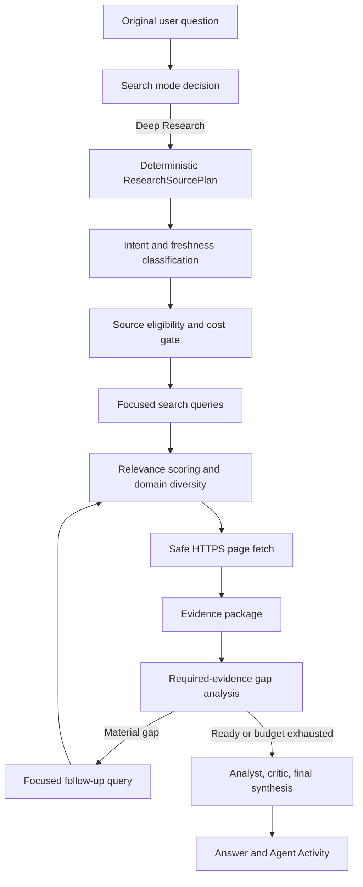

# Deep Research Source Routing (Historical)

> Superseded by [LLM Research Orchestration](llm-research-orchestration.md).
> The classifiers and source-plan fields below remain only as compatibility
> and telemetry metadata. They no longer select, enable, disable, or sequence
> Research Agent tools.

## Purpose

Deep Research chooses evidence classes from the user's question before it
executes search tools. The goal is not to maximize the number of providers or
documents. The goal is to select sources that can materially answer the
question, fetch the selected pages, and synthesize only from evidence that was
actually read.

This design separates two decisions that must not be conflated:

1. **Research depth** determines whether the runtime performs no search, quick
   search, or iterative Deep Research.
2. **Source intent** determines which evidence classes are eligible inside that
   research mode.

Selecting Deep Research does not imply academic intent. Academic Intelligence
is a specialized source class and remains disabled unless the original user
question explicitly requests scholarly evidence.

## Design Goals

- Route evidence by the original question's intent.
- Keep Academic Intelligence default-off.
- Preserve Scopus, Web of Science, OpenAlex, Semantic Scholar, Crossref,
  Google Scholar discovery, and Unpaywall for explicit academic requests.
- Prioritize current primary and financial evidence for earnings and market
  questions.
- Treat search snippets as discovery metadata, never as verified evidence.
- Fetch and read selected source pages before synthesis.
- Measure completeness against required evidence fields rather than source
  count.
- Keep current-market evidence and academic context separate in mixed requests.
- Expose routing decisions in Agent Activity without exposing private reasoning.
- Bound network work, fetched text, and model context.

## Runtime Flow



The source plan is computed once from the original question in
`AgentRuntime._run_deep_research()`. Every research round retains that question
as the first item passed to the tool registry. Generated follow-up queries can
narrow a missing evidence field, but they cannot enable a source class that the
user did not request.

## Source Plan Schema

`runtime/tool_registry.py` defines the immutable `ResearchSourcePlan`:

| Field | Meaning |
| --- | --- |
| `intents` | One or more deterministic intent classes. |
| `freshness_priority` | `VERY_HIGH` for current requests; otherwise `NORMAL`. |
| `academic_enabled` | Whether academic providers may execute. |
| `required_evidence` | Fields used to judge evidence completeness. |
| `selected_sources` | Human-readable source classes selected for the request. |
| `skipped_sources` | Source classes deliberately excluded by the cost gate. |

The plan is returned as a `research_source_plan` tool observation and is also
stored in `ChatResult.research.source_plan` for Agent Activity.

## Intent Classes

The router may assign multiple intents to one question.

| Intent | Typical signals | Effect |
| --- | --- | --- |
| `CURRENT_NEWS` | today, current, latest, breaking, 발표, 오늘, 최신 | Sets freshness to `VERY_HIGH` and favors current reporting. |
| `MARKET_FINANCE` | earnings, revenue, EPS, guidance, consensus, stock, 실적, 매출, 주가 | Enables the market evidence checklist and focused financial queries. |
| `ACADEMIC_RESEARCH` | papers, publications, citations, DOI, researcher, 논문, 학술, 교수 | Opens the Academic Intelligence gate. |
| `COMPANY_RESEARCH` | company, competitors, IR, SEC filing, NVIDIA, TSMC, 기업 | Adds company context and official-source preference. |
| `TECHNICAL_RESEARCH` | architecture, performance, API, GPU, 기술, 성능 | Identifies technical evidence needs without automatically enabling academics. |
| `GENERAL_WEB` | No specialized pattern matched | Uses general web search and fetched pages. |
| `MIXED` | Academic intent plus current, market, or company intent | Requires separated current-market and academic synthesis sections. |

Classification is deterministic and intentionally conservative. A question
about AI, a technology company, GPUs, or semiconductors is not academic merely
because scholarly literature could exist about the topic.

## Academic Intelligence Gate

Academic Intelligence is disabled by default. It is enabled only when the
original question explicitly asks for one or more of the following:

- papers, publications, journals, or DOI records;
- scholarly or academic evidence;
- a professor, researcher, or research-output evaluation;
- citations, h-index, bibliometrics, or representative papers.

When enabled for a researcher query, the existing multi-provider Academic
Intelligence pipeline remains intact. It can use Scopus, Web of Science,
OpenAlex, Semantic Scholar, Crossref, Google Scholar discovery, ORCID, and
Unpaywall according to provider availability and evidence gaps.

For a non-person academic request, the runtime uses the academic paper path and
may add Semantic Scholar or Unpaywall evidence when the gap logic requests it.

For a current earnings request, academic providers are skipped even if the
company operates in AI or advanced technology. The plan records:

```text
Academic Intelligence — not relevant
```

This is both a relevance rule and a cost gate. It prevents paid API calls,
latency, and irrelevant paper metadata from entering a current-market answer.

## Current Market Routing

Current earnings and market questions receive a `VERY_HIGH` freshness priority.
For supported companies, the initial search bundle is built around the current
UTC month and year.

The NVIDIA bundle includes queries for:

1. NVIDIA Investor Relations;
2. NVIDIA Newsroom as a fetchable official alternative;
3. SEC 8-K earnings filings;
4. Reuters earnings and consensus reporting;
5. revenue, EPS, guidance, and options-implied movement.

The source hierarchy is:

| Tier | Examples | Relevance score |
| --- | --- | --- |
| Official primary | Investor Relations, company newsroom, SEC | `1.00` |
| Current financial news | Reuters, Bloomberg, CNBC, WSJ, FT, AP | `0.95` |
| Market and analyst data | Nasdaq, MarketWatch, Yahoo Finance, Investing.com, Morningstar | `0.85` |
| Explicitly enabled academic evidence | Academic domains | `0.90` |
| Topically relevant market pages | Pages mentioning earnings, revenue, EPS, guidance, or consensus | `0.70` |
| Generic relevant web pages | Other retained results | `0.40` |
| Academic pages when disabled | Academic domains | `0.05`, then excluded |

Results below `0.25` are discarded. After scoring, the router retains no more
than two results from one hostname. This prevents a single SEC archive, company
site, or aggregator from occupying every fetch slot and gives independent news
and market-data tiers a chance to reach the reading stage.

### Required Market Evidence

Market completeness is evaluated against these fields:

- official earnings date;
- official release timing;
- conference call time;
- revenue consensus;
- EPS consensus;
- guidance expectation;
- stock reaction or recent price movement;
- analyst commentary;
- optional implied move.

The gap analyzer must not declare completion merely because several tools or
documents returned successfully. Missing fields remain explicit. Follow-up
queries target those gaps and cannot substitute academic literature for missing
market evidence.

## Search Is Discovery, Fetch Is Evidence

`web_search` results contain titles, URLs, descriptions, provider names, and
relevance scores. Their snippets are candidate-discovery metadata. They are not
treated as proof.

For Deep Research, `web_sources` attempts to fetch the ranked candidates over
public HTTPS. The fetcher:

- rejects private, loopback, credential-bearing, or non-HTTPS targets;
- validates every redirect destination;
- accepts HTML responses only;
- parses at most 1,000,000 HTML characters;
- retains at most 6,000 extracted text characters per source;
- rejects pages with fewer than 200 extracted characters;
- fetches at most five successful sources per tool execution;
- preserves the search-stage relevance score with the fetched page;
- records per-URL success, failure reason, byte count, text length, and timing.

Parsing up to 1 MB is important for modern newsroom pages whose article body
appears after a large script-heavy `<head>`. The output remains bounded because
only 6,000 normalized text characters are retained.

Typical failure reasons include HTTP blocking, timeout, network failure,
non-HTML content, redirect validation failure, and
`insufficient_extracted_text`. A failed fetch is reported as a limitation; the
runtime must not imply that it read the page.

## Follow-Up Cost Gate

The first market round generates the complete official, SEC, news, and
consensus query bundle. A later round still carries the original question for
intent control, but `_source_queries()` executes only the gap queries proposed
for that round. It does not repeat the full initial bundle.

This preserves the security and relevance property of original-query routing
while avoiding repeated search API calls and duplicate evidence.

Deep Research remains bounded to four rounds. If required fields are still
missing when the budget is exhausted, final synthesis proceeds with explicit
limitations rather than fabricating completeness.

## Evidence Packaging and Synthesis

Fetched pages enter the evidence package with:

- title;
- final URL;
- extracted text;
- relevance score;
- `evidence_group: current_web`.

Duplicate records are removed by URL or title. The evidence package retains up
to 1,200 characters per web source before applying the global 12,000-character
context bound. This is long enough to reach article content that follows site
navigation while retaining the existing bounded-context behavior.

For market questions, the package also includes `research_as_of` timestamps in
UTC and Korea Standard Time. This gives the model factual context for relative
terms such as "today" and supports ET/KST event-time presentation.

The three-stage synthesis pipeline remains:

1. **Analyst** builds an evidence-grounded draft.
2. **Critic** identifies unsupported claims, missing limitations, and weak
   coverage.
3. **Final revision** produces the terminal answer in the user's language.

Market synthesis is instructed to cover, where evidence permits:

- schedule in US Eastern Time and Korea Standard Time;
- revenue and EPS consensus;
- guidance and watch points;
- current or post-release market reaction;
- bull, base, and bear scenarios;
- post-release checks;
- disagreements between sources.

Unavailable facts are labeled `NOT VERIFIED`. Academic-paper or bibliometric
sections are prohibited in a market-only answer.

For `MIXED` requests, the answer separates **Current Market Evidence** from
**Academic Context**. An academic paper cannot directly prove a current earnings
date, consensus estimate, or same-day price reaction. Conversely, current news
does not establish scholarly impact or citation performance.

## Agent Activity

The browser Activity panel displays the source plan alongside existing research
state information:

- Research Intent;
- Freshness;
- Selected Sources;
- Skipped Sources;
- Required Evidence.

These fields explain what the router selected and excluded. They do not expose
hidden chain-of-thought or private model reasoning.

## Regression Matrix

The A-F routing matrix covers the required cross-domain behavior:

| Case | Question type | Expected routing |
| --- | --- | --- |
| A | Current NVIDIA earnings | Current, market, and company intents; academics off. |
| B | Professor or researcher evaluation | Academic intent; Academic Intelligence on. |
| C | Current Bitcoin market | Current and market intents; academics off. |
| D | Academic papers about stock markets | Academic and market intents; mixed routing. |
| E | Current TSMC earnings | Current, market, and company intents; academics off. |
| F | NVIDIA earnings plus academic AI-bubble research | Current, market, company, academic, and mixed intents. |

Additional tests verify:

- current-market requests never invoke academic tools;
- academic and mixed requests preserve academic tools;
- official and current-news sources outrank generic pages;
- disabled academic domains are excluded;
- hostname diversity prevents source crowding;
- follow-up rounds search only gap queries;
- fetched pages retain relevance metadata;
- short or empty page shells are rejected;
- article bodies after large HTML heads are read;
- official details after navigation text survive evidence bounding;
- UTC and KST research timestamps reach market synthesis;
- original questions remain the sole source-intent gate.

Run the focused suite with:

```bash
cd /root/local-ai-agent
/srv/local-ai-agent/venv/bin/python -m unittest tests.test_web_runtime -v
```

Run all repository tests with:

```bash
cd /root/local-ai-agent
/srv/local-ai-agent/venv/bin/python -m unittest discover -s tests -v
```

## NVIDIA Production Benchmark

The production benchmark question was:

```text
NVIDIA 오늘 실적 발표 일정과 시장 전망, 컨센서스, 주가에 어떤 영향을 줄 것으로 보는지 조사해줘.
```

Observed routing:

- intents: `CURRENT_NEWS`, `MARKET_FINANCE`, `COMPANY_RESEARCH`;
- freshness: `VERY_HIGH`;
- Academic Intelligence: disabled;
- tools: `research_source_plan`, `web_search`, `web_sources`;
- academic paper tools: absent.

The live fetch path read NVIDIA Newsroom and SEC pages rather than relying on
search snippets. The official newsroom text established the conference call on
August 26, 2026 at 2 p.m. PT / 5 p.m. ET, corresponding to August 27 at 8 a.m.
KST. The synthesis cited the official source, separated historical reported
figures from forward consensus, and marked unavailable consensus, implied move,
and analyst figures `NOT VERIFIED`.

Some official Investor Relations pages returned HTTP 403. NVIDIA Newsroom was
therefore an important official and fetchable alternative. This illustrates why
source ranking and fetchability are separate concerns: a source can be highly
authoritative yet unavailable to the server-side reader.

## Operational Verification

After changing source routing:

1. Run the focused web runtime suite.
2. Run the complete repository test suite.
3. Run Python and JavaScript syntax checks.
4. Execute a live market benchmark and inspect tools, source plan, fetched URLs,
   final answer, and `NOT VERIFIED` handling.
5. Restart `local-ai-web.service`.
6. Verify local health on port 7000 and public health through HTTPS.
7. Confirm the deployed `app.js` contains the Activity source-plan fields.

Example checks:

```bash
cd /root/local-ai-agent
/srv/local-ai-agent/venv/bin/python -m py_compile \
  runtime/tool_registry.py runtime/web_search.py runtime/agent_runtime.py
node --check web/static/app.js
systemctl restart local-ai-web.service
curl -fsS http://127.0.0.1:7000/health
curl -fsS https://ahnbys.inu.ac.kr/health
```

## Files and Ownership

| File | Responsibility |
| --- | --- |
| `runtime/tool_registry.py` | Intent classification, source plan, tool eligibility, focused queries, relevance ranking, domain diversity. |
| `runtime/web_search.py` | Search adapters, safe public-page fetch, extraction bounds, fetch diagnostics. |
| `runtime/agent_runtime.py` | Original-question gate, research rounds, gap analysis, evidence package, market and mixed synthesis. |
| `agents/research/instructions.md` | Agent-level evidence and source-routing policy. |
| `web/static/app.js` | Source-plan visibility in Agent Activity. |
| `tests/test_web_runtime.py` | Routing, fetching, synthesis, and regression coverage. |

## Known Limits

- Domain lists and company official-source mappings are explicit and currently
  include dedicated mappings for NVIDIA and TSMC. Unknown companies use a
  generic official Investor Relations query.
- Search providers can discover pages that reject server-side fetches.
- Some JavaScript-heavy pages return navigation text without the desired data.
- Public pages may omit proprietary consensus figures available only from
  Bloomberg, FactSet, Refinitiv, or similar licensed providers.
- Relevance scores are deterministic routing heuristics, not a claim-quality or
  truth score.
- The system does not treat a URL, title, or snippet as proof when page text
  could not be fetched.
- Four rounds can end with unresolved required evidence. The correct outcome is
  a bounded answer with `NOT VERIFIED` fields, not unsupported completion.

## Extension Guidelines

When adding a new intent, provider, or company mapping:

1. Define the evidence need, not merely a keyword category.
2. State whether the source class is default-on or explicitly gated.
3. Add required evidence fields for completeness decisions.
4. Assign source tiers and exclusion behavior.
5. Preserve the original-question gate.
6. Add fetchability and content-quality tests, not search-result tests alone.
7. Add a mixed-domain case when the new intent can coexist with another source
   class.
8. Expose the decision in Activity when users need to understand it.
9. Run a live benchmark that checks both source selection and final synthesis.

The governing rule remains: use the smallest set of current, relevant,
independently useful sources that can answer the question, and state clearly
when the evidence cannot support a requested claim.