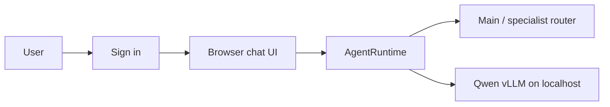

# Local Agent Web Chat

This browser interface calls `runtime.AgentRuntime`, which loads the existing
agent policy and instruction files before calling the localhost vLLM endpoint.
It is not a direct browser-to-vLLM client.



## Chat Experience

- Choose **AUTO / Main**, Main, or Research. Browser users cannot access Coding,
  Server, local project files, or local system diagnostics.
- `Enter` sends a message; `Shift+Enter` creates a new line. Korean IME composition is handled before submission.
- Requests are serialized while an answer is running, preventing duplicate trailing-character submissions.
- Markdown headings, lists, quotes, inline code, and fenced code blocks render in the chat.
- Code blocks include `Copy code`. For normal prose, select only the needed text to reveal `Copy selection`.
- `/image <prompt>` generates a 512×512 PNG with the local SD-Turbo service. Attach one image and send
	`/edit <instruction>` for image-to-image editing. Generated images include a download link and reproducible seed.
- `New Chat` creates a fresh short-term session. Long-term memory is not changed.

## Accounts And Sessions

Start the UI from the repository root:

```bash
./web/run.sh
```

`./web/run.sh` is convenient for an interactive local test, but its process
ends with the terminal session. For normal operation, install and enable
`infra/systemd/local-ai-web.service` as described in the repository README.
The service starts after vLLM, restarts automatically if the web process exits,
and starts again after a host reboot.

The UI requires a manually provisioned account; there is no public registration.
Keep deployment addresses, hostnames, ports, and other infrastructure details out
of this repository and browser conversations. Create an administrator, manager or
guest from the server terminal. The command prompts for the password so it is
never placed in shell history or the repository. Passwords must contain at least
8 characters:

```bash
/srv/local-ai-agent/venv/bin/python scripts/manage-users.py create admin YOUR_ADMIN_USERNAME
/srv/local-ai-agent/venv/bin/python scripts/manage-users.py create manager MANAGER_USERNAME
/srv/local-ai-agent/venv/bin/python scripts/manage-users.py create guest GUEST_USERNAME
```

To replace a forgotten password, use the existing username. The command prompts
for the new password twice:

```bash
/srv/local-ai-agent/venv/bin/python scripts/manage-users.py set-password YOUR_USERNAME
```

Set `WEB_SESSION_SECRET` in the host `.env` before long-running use. The user
database is stored at `local-memory/web-users.sqlite3` and is ignored by Git.

There is no public registration. An administrator creates accounts directly on
the server. A single guest account may be shared by multiple people: each login
receives a separate signed browser session and cannot reuse another browser's
chat session ID. Shared credentials do not provide individual attribution or
per-person revocation.

The header shows the active account. **Switch account** logs out and returns to
the login screen. Administrator sessions use a 24-hour sliding expiry, manager
sessions use a 30-minute sliding expiry, and guest sessions use a 15-minute
sliding expiry. Override these with `WEB_ADMIN_SESSION_IDLE_MINUTES`,
`WEB_MANAGER_SESSION_IDLE_MINUTES`, and `WEB_SESSION_IDLE_MINUTES`. Managers
have the same web agent access as administrators. Guest accounts cannot upload
files; the attachment control is hidden and the upload endpoint independently
rejects them.

## Security Boundary

Browser sessions never receive local project files, source code, system status,
logs, network information, hardware information, service names, configuration,
or filesystem paths. This boundary applies to administrators and guests alike.

The interface uses HTTP by default. HTTP does not encrypt passwords, chat
content, or cookies in transit. Do not expose it to the public internet until
it is placed behind HTTPS. For a public deployment, use a domain name and a
reverse proxy such as Caddy to terminate TLS, then set `WEB_SECURE_COOKIE=1`.
An IP address alone is generally not sufficient for a normal publicly trusted
certificate.

## Automatic Web Verification

In **AUTO / Main**, the runtime first decides whether the request needs current
external evidence:

- **No search**: translation, writing, supplied-text work, stable concepts, and local server or repository questions.
- **Quick search**: current facts, recent events, prices, availability, schedules, policy changes, and fact checks. Uses at most 5 results.
- **Deep research**: multi-source comparisons, reports, recommendations, and medical, legal, financial, or contested claims. Uses at most 8 results.

Search runs only through the Research Agent's bounded `web_search` tool. Korean
queries prefer Naver when it is configured; global queries use Brave. For Deep
Research, the model first creates two to four complementary research queries,
then the runtime collects deduplicated search results, up to five public HTTPS
HTML sources, and public OpenAlex work metadata. OpenAlex is used for structured
title, DOI, date, venue, author, and citation fields; it is not treated as a
complete quality judgement. Those source texts and structured metadata, not
search snippets, are the basis for factual claims and adjacent URL citations.
Reddit is non-authoritative context only. If no source text is available, the
answer must label itself a limited search-result overview instead of presenting
unverified details as facts.

The initial provider is Brave Search. The existing **Search** API subscription is
sufficient; Brave Answers is not used or required. Create an API key with Brave, then place
it only in the ignored host `.env` file:

```bash
BRAVE_SEARCH_API_KEY=your-brave-search-api-key
NAVER_SEARCH_CLIENT_ID=your-naver-client-id
NAVER_SEARCH_CLIENT_SECRET=your-naver-client-secret
```

Naver is useful for Korean web, news, blog, and local service discovery; Brave
is useful for global web results. Kakao and Google credential placeholders are
available in `.env.example`, but adapters are intentionally not enabled yet so
an unused key never triggers unexpected requests or cost.

Restart the persistent UI after adding or changing the key:

```bash
sudo systemctl restart local-ai-web.service
./scripts/web-healthcheck.sh
```

Endpoints:

- `GET /health`
- `POST /api/login`
- `POST /api/logout`
- `GET /api/agents`
- `POST /api/new-session`
- `POST /api/chat`

Sessions are process-memory only. A New Chat starts a fresh UUID session and
does not persist or alter long-term memory. Streaming is intentionally deferred
until the non-streaming runtime path is validated.