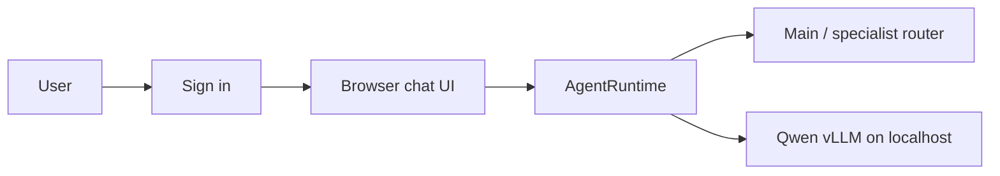

# Local Agent Web Chat

This browser interface calls `runtime.AgentRuntime`, which loads the existing
agent policy and instruction files before calling the localhost vLLM endpoint.
It is not a direct browser-to-vLLM client.



## Chat Experience

- Choose **AUTO / Main** for normal delegation, or select Main, Coding, Research, or Server directly.
- `Enter` sends a message; `Shift+Enter` creates a new line. Korean IME composition is handled before submission.
- Requests are serialized while an answer is running, preventing duplicate trailing-character submissions.
- Markdown headings, lists, quotes, inline code, and fenced code blocks render in the chat.
- Code blocks include `Copy code`. For normal prose, select only the needed text to reveal `Copy selection`.
- `New Chat` creates a fresh short-term session. Long-term memory is not changed.

## Accounts And Sessions

Start the UI from the repository root:

```bash
./web/run.sh
```

`./web/run.sh` is convenient for an interactive local test, but its process
ends with the terminal session. For normal operation, install and enable
`infra/systemd/local-ai-web.service` as described in the repository README.
The service starts after vLLM, restarts automatically if the web process exits,
and starts again after a host reboot.

The default listener is `0.0.0.0:8080`, while vLLM remains private at
`127.0.0.1:8000`. Open `http://117.16.245.72:8080` from a browser on a network
that permits this host and port. The UI requires a manually provisioned account;
there is no public registration. Create an initial administrator or guest from
the server terminal. The command prompts for the password so it is never placed
in shell history or the repository. Passwords must contain at least 8 characters:

```bash
/srv/local-ai-agent/venv/bin/python scripts/manage-users.py create admin YOUR_ADMIN_USERNAME
/srv/local-ai-agent/venv/bin/python scripts/manage-users.py create guest GUEST_USERNAME
```

To replace a forgotten password, use the existing username. The command prompts
for the new password twice:

```bash
/srv/local-ai-agent/venv/bin/python scripts/manage-users.py set-password YOUR_USERNAME
```

Set `WEB_SESSION_SECRET` in the host `.env` before long-running use. The user
database is stored at `local-memory/web-users.sqlite3` and is ignored by Git.

There is no public registration. An administrator creates accounts directly on
the server. A single guest account may be shared by multiple people: each login
receives a separate signed browser session and cannot reuse another browser's
chat session ID. Shared credentials do not provide individual attribution or
per-person revocation.

The header shows the active account. **Switch account** logs out and returns to
the login screen. A browser with no click, keyboard, input, scroll, or touch
activity for 15 minutes is logged out automatically. The server cookie uses the
same 15-minute sliding expiry.

## Security Boundary

The interface uses HTTP by default. HTTP does not encrypt passwords, chat
content, or cookies in transit. Do not expose it to the public internet until
it is placed behind HTTPS. For a public deployment, use a domain name and a
reverse proxy such as Caddy to terminate TLS, then set `WEB_SECURE_COOKIE=1`.
An IP address alone is generally not sufficient for a normal publicly trusted
certificate.

## Automatic Web Verification

In **AUTO / Main**, the runtime first decides whether the request needs current
external evidence:

- **No search**: translation, writing, supplied-text work, stable concepts, and local server or repository questions.
- **Quick search**: current facts, recent events, prices, availability, schedules, policy changes, and fact checks. Uses at most 5 results.
- **Deep research**: multi-source comparisons, reports, recommendations, and medical, legal, financial, or contested claims. Uses at most 8 results.

Search runs only through the Research Agent's bounded `web_search` tool. The
answer must identify web-verified claims and cite relevant result URLs. If the
search provider is unavailable, it must state that current verification failed
instead of presenting model knowledge as a current fact.

The initial provider is Brave Search. Create an API key with Brave, then place
it only in the ignored host `.env` file:

```bash
BRAVE_SEARCH_API_KEY=your-brave-search-api-key
```

Restart the persistent UI after adding or changing the key:

```bash
sudo systemctl restart local-ai-web.service
./scripts/web-healthcheck.sh
```

## Automatic Web Verification

For `AUTO / Main`, the runtime first asks the model to choose one mode for each
request: `NO_SEARCH`, `QUICK_SEARCH`, or `DEEP_RESEARCH`. Translation, writing,
stable concepts, and local workspace/server questions normally remain local.
Current facts and recent events use quick search; multi-source comparisons and
high-stakes guidance use deep research.

Automatic search uses the bounded Brave Search API through the Research Agent.
It sends only the user query, returns at most 5 quick-search or 8 deep-research
result snippets, and passes title, URL, and description to the model. Add the
real key only to the ignored host `.env` file, then restart the web UI:

```bash
BRAVE_SEARCH_API_KEY=your-key
```

Without this key, requests selected for web verification report that current
verification is unavailable; they do not silently invent current sources.

Endpoints:

- `GET /health`
- `POST /api/login`
- `POST /api/logout`
- `GET /api/agents`
- `POST /api/new-session`
- `POST /api/chat`

Sessions are process-memory only. A New Chat starts a fresh UUID session and
does not persist or alter long-term memory. Streaming is intentionally deferred
until the non-streaming runtime path is validated.